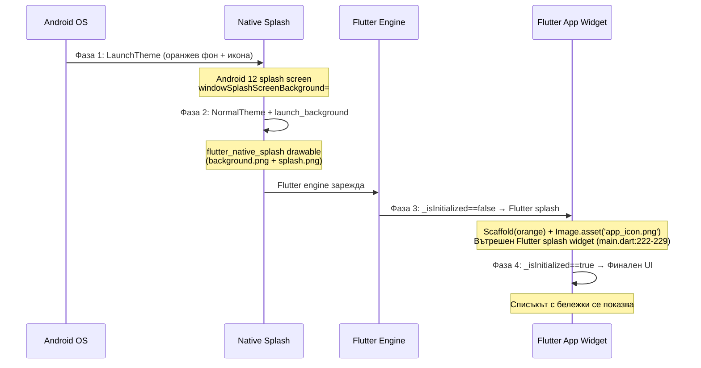
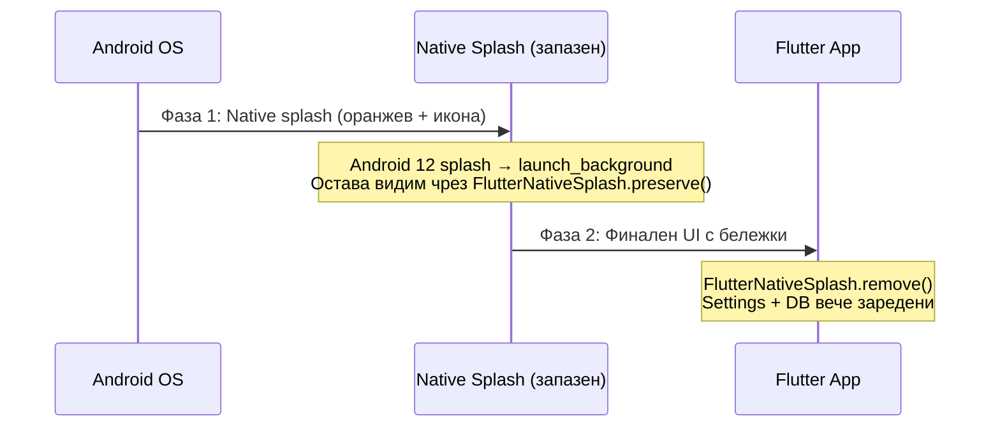

# Анализ на проблема с многофазното стартиране

## Текущо поведение (4 фази)

## Причини за проблема

### Фаза 1 → Фаза 2: Двоен native splash
- **Android 12+ (API 31+)** използва собствен splash screen API (`windowSplashScreenBackground` + `windowSplashScreenAnimatedIcon`) от [values-v31/styles.xml](file:///c:/dev/Projects/Androd/my_scr/android/app/src/main/res/values-v31/styles.xml)
- Веднага след него се показва `launch_background.xml` (генериран от `flutter_native_splash`) с `background.png` + `splash.png` — **втори** подобен splash

### Фаза 2 → Фаза 3: Трети splash (Flutter widget)
- В [main.dart:222-229](file:///c:/dev/Projects/Androd/my_scr/lib/main.dart#L222-L229) има проверка `if (!_isInitialized)` която показва **трети** splash с оранжев Scaffold + `app_icon.png`
- Този Flutter splash е видим докато се зареждат настройките, базата данни и се проверява за споделени данни

### Фаза 3 → Фаза 4: Бележките мигат
- `_isInitialized` се сетва в `addPostFrameCallback` (ред 82), което означава че UI-то минава през цикъл: splash → бележки без стилове → бележки с пълни стилове

## Предложени промени

### 1. Премахване на Flutter splash widget-а (main.dart)
Вътрешният Flutter splash (`_isInitialized` guard) е **излишен** — native splash-ът вече показва иконата. Трябва да се запази native splash-ът докато Flutter е готов, и да се покаже директно финалния UI.

Вместо `_isInitialized` guard, ще използваме `FlutterNativeSplash.preserve()` + `FlutterNativeSplash.remove()` — **native splash-ът ще остане видим** докато приложението се инициализира напълно, и ще се премахне едва когато всичко е заредено.

### 2. Синхронизиране на NormalTheme с launch_background
`NormalTheme` в `values-v31` използва `?android:colorBackground` (бяло/черно) вместо оранжевия `launch_background`. Това причинява бял "flash" между splash и Flutter. Трябва да се уеднакви.

### 3. Зареждане на settings + DB преди първия кадър
Преместване на `_loadSettings()` и `_refreshItems()` в `main()` функцията преди `runApp()`, така че когато Flutter покаже първия кадър, данните вече са заредени.

## Конкретни промени по файлове

| Файл | Промяна |
|------|---------|
| [main.dart](file:///c:/dev/Projects/Androd/my_scr/lib/main.dart) | Добавяне на `FlutterNativeSplash.preserve()` в `main()`, премахване на `_isInitialized` splash widget, извикване на `FlutterNativeSplash.remove()` след пълна инициализация |
| [values-v31/styles.xml](file:///c:/dev/Projects/Androd/my_scr/android/app/src/main/res/values-v31/styles.xml) | NormalTheme → `windowBackground` = `@drawable/launch_background` |
| [values-night-v31/styles.xml](file:///c:/dev/Projects/Androd/my_scr/android/app/src/main/res/values-night-v31/styles.xml) | Същото за dark mode |

## Очакван резултат (2 фази)

> [!IMPORTANT]
> Потвърди дали да продължа с имплементацията на тези промени.
